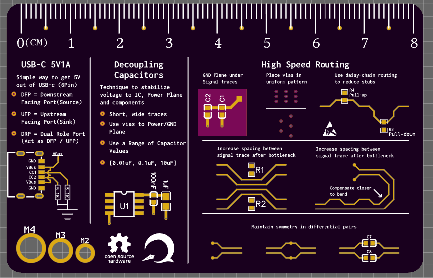
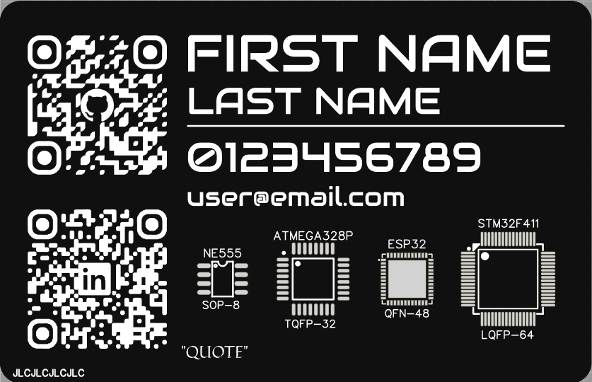

# PCB_Business_Card
This repo consists of a collection of the PCB business cards that I have designed / will be designed in the future. My main goal with this project is to open source my works that have: PCB, design docs and BOM.

  
  

**Key:**  
S = Schematic  
**P = PCB  **
F = Firmware and/or software  
M = Mechanical CAD files  
**D = Design Documentation  **
**B = Bill Of Materials  **
C = License used allows for commercial use  

*[Referred EEVBlog's OSHW logo Key](https://www.eevblog.com/oshw/)*

## Completed works
### Version 2

**[PCB Business Reference Ruler V2](PCB_Business_Card_Ruler_v2.md)**

### Version 1

**[PCB Business Reference Ruler](PCB_Business_Card_Ruler.md)**

### Upcoming ...
PCB Business Circuit Card

### References
https://github.com/JLCPCB/PCB-Business-card?tab=readme-ov-file
